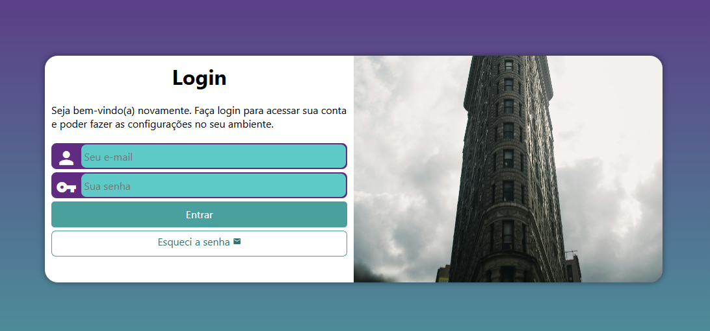

# ✅ **Projeto: Página de Login Responsiva**

### **📝 Descrição curta (para colocar no portfólio)**

Uma página de login moderna e responsiva desenvolvida com **HTML5 e CSS3**, aplicando o princípio de **Mobile First**. O projeto destaca boas práticas de layout, organização visual e adaptação para diferentes tamanhos de tela, simulando o fluxo de autenticação de um sistema real.

---

# 🔧 **Tecnologias utilizadas**

* **HTML5**
* **CSS3**
* Design responsivo (media queries)
* Organização modular do CSS

---

# 🎯 **Destaques técnicos**

* Layout limpo e bem estruturado, inspirado em interfaces profissionais.
* Elementos visuais bem alinhados e padronizados.
* Tipografia adequada e boa hierarquia visual.
* Estrutura semântica bem utilizada, com headings e containers organizados.
* Responsividade funcionando corretamente em diferentes larguras.
* Ótimo exercício de interface: Domínio de **estrutura + styling**.

---

# 🚀 **Link para demonstração**

🔗 **Deploy:**
[https://rafaelamaral-dev.github.io/projeto-login/](https://rafaelamaral-dev.github.io/projeto-login/)

🔗 **Repositório GitHub:**
[https://github.com/rafaelamaral-dev/projeto-login](https://github.com/rafaelamaral-dev/projeto-login)

🖼 **Preview:** 

---

# ⭐ **Habilidades agregadas por este projeto ao portfólio**

* Domínio de **HTML e CSS**.
* Demonstração de cuidado com **UI e responsividade**.
* Projeto visualmente agradável.

---
